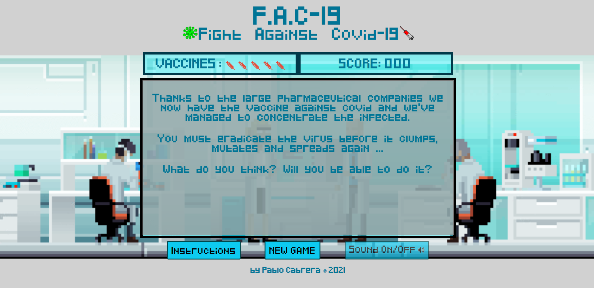

# F.A.C-19 
FAC is my first completed deployed proyect. Its been created for the Ironhack's Web Develpment bootcamp in less than one week so much can still be improved. I've used Canvas for the game, Vainilla JS for DOM manipulation, Bootstrap for the buttons and some CSS3 for the styling. The theme of the game is about COVID. The acronym comes from Fight Against Covid-19.

FAC-19 is a shotter type game where your mouse skills matters. You score for each virus you kill but as you get more points the difficulty increases (viruses appear faster). If you let too many viruses accumulate, you will lose lives until you lose all and, surpirse, **GAME OVER**. 
It is not possible to win in this game, but you can try to beat your own record or compete with someone to see who scores the most points. Go try it and have fun!

## Try it yourself! :computer:
Netlify URL :  https://fac-19.netlify.app/

## Tools used 🛠️
* [PixelArtMaker](http://pixelartmaker.com/) - To create the pixel images online.
* [ResizeImage](https://resizeimage.net/) - To resize the images online.

* [Mixkit](https://mixkit.co/free-sound-effects/game/) - Free sounds and music for my game.
* [TwistedWave](https://twistedwave.com/online) - Audio editor online.

## Technologies ⌨️
* HTML5
* CCS3
* BOOTSTRAP
* CANVAS
* JAVASCRIPT

## Author✒️
* **Pablo Cabrera Rosado** - [PabloCabreraR](https://github.com/PabloCabreraR)

#ONCE IRONHACKER, ALWAYS AN IRONHACKER
